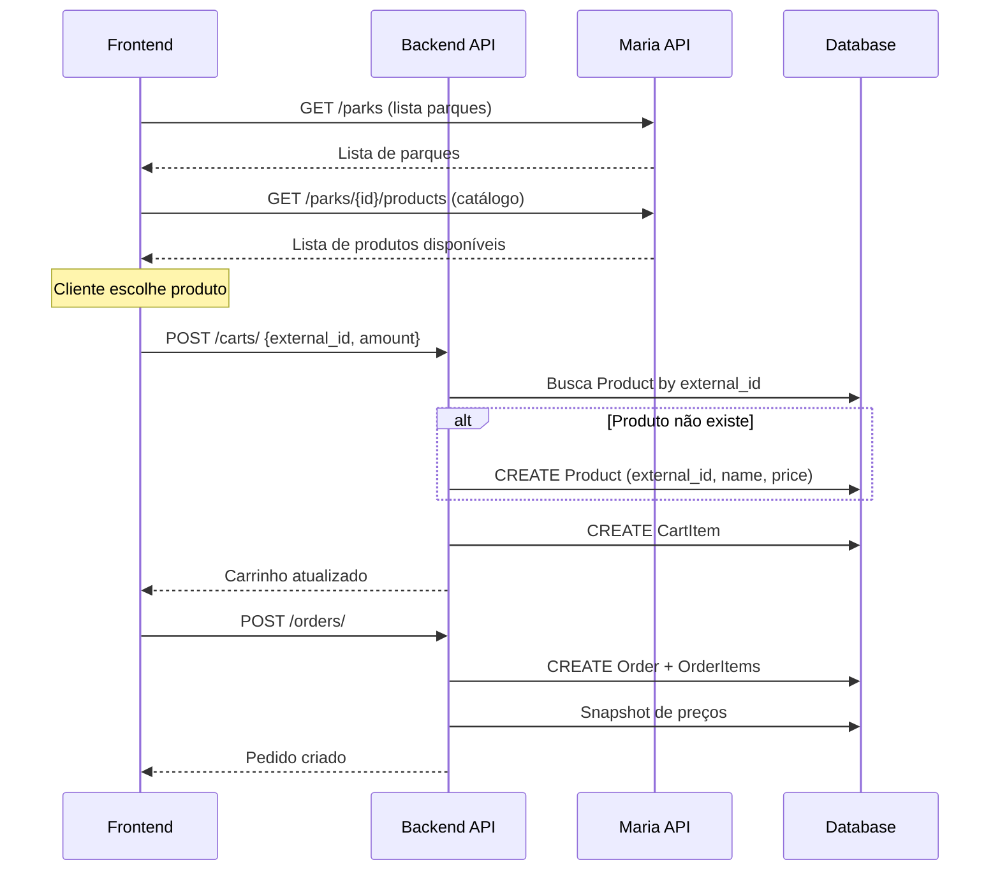

# Magic Marketplace - Visão Geral do Projeto

## 📋 Descrição

Magic Marketplace é um sistema de marketplace multi-tenant especializado na venda de ingressos para parques temáticos (Disney). O sistema integra com a **Maria API** para obter informações atualizadas sobre parques e produtos disponíveis.

## 🎯 Objetivo Principal

Criar um marketplace onde:
- **Sellers** podem criar lojas e gerenciar produtos
- **Customers** podem comprar produtos através dessas lojas
- **Integração com Maria API** fornece catálogo de produtos em tempo real
- **Produtos são salvos no banco apenas quando necessário** (quando entram no carrinho)

## 🏗️ Arquitetura do Sistema

### Camadas da Aplicação

```
┌─────────────────────────────────────────┐
│         FastAPI Application             │
├─────────────────────────────────────────┤
│  Routes (seller, customer, store,       │
│          cart, order)                   │
├─────────────────────────────────────────┤
│  Authentication Layer                   │
│  (customer_required, seller_required,   │
│   store_required decorators)            │
├─────────────────────────────────────────┤
│  Business Logic (utils.py)              │
├─────────────────────────────────────────┤
│  Models (Tortoise ORM)                  │
├─────────────────────────────────────────┤
│  Database (SQLite/PostgreSQL)           │
└─────────────────────────────────────────┘

         ↕️  Integração Externa

┌─────────────────────────────────────────┐
│         Maria API Integration           │
│  (integrations/maria_api/)              │
└─────────────────────────────────────────┘
```

## 🔑 Conceitos Fundamentais

### 1. Multi-Tenancy por Store

- Cada **Seller** pode criar uma ou mais **Stores**
- Cada **Store** tem uma `credential` única (UUID)
- **Customers** são vinculados a uma **Store** específica
- Todas as operações requerem a `Store-Credential` no header

### 2. Sistema de Autenticação

Existem dois tipos de usuários com autenticações independentes:

- **Seller**: Gerencia lojas e produtos
  - Header: `Seller-Authorization: Bearer {token}`
  
- **Customer**: Compra produtos de uma loja
  - Header: `Customer-Authorization: Bearer {token}`

Ambos usam:
- Header: `Store-Credential: {uuid}`

### 3. Fluxo de Produto Lazy Loading

**Problema**: Produtos da Maria API mudam constantemente (preços, disponibilidade, novos produtos)

**Solução**: Lazy Loading de Produtos
```
1. Frontend consulta Maria API → Lista de produtos disponíveis (vitrine)
2. Cliente adiciona produto ao carrinho
3. Neste momento: Produto é criado no banco de dados
4. Produto salvo com external_id (código da Maria API)
5. Métricas e histórico disponíveis para produtos que tiveram interesse
```

**Vantagens**:
- Banco de dados limpo (apenas produtos com interesse real)
- Facilita métricas de conversão
- Não precisa sincronizar catálogo completo
- Histórico de preços no momento da compra

## 📦 Principais Entidades

### Seller
- Dono de uma ou mais lojas
- Gerencia produtos e configurações da loja

### Store
- Tenant principal do sistema
- Possui uma credential única
- Agrega customers, products, orders

### Customer
- Usuário final que compra produtos
- Vinculado a uma store específica

### Product
- Representa um produto vendido na loja
- `external_id`: Código do produto na Maria API
- Criado apenas quando adicionado ao carrinho

### Cart
- Carrinho de compras ativo de um customer
- Status: 'active' ou 'abandoned'

### Order
- Pedido finalizado
- Snapshot dos produtos e preços no momento da compra

## 🔄 Fluxo Completo de Compra



## 🛠️ Tecnologias

- **FastAPI**: Framework web moderno e performático
- **Tortoise ORM**: ORM assíncrono para Python
- **SQLite**: Banco de dados (pode ser PostgreSQL em produção)
- **Aerich**: Sistema de migrações para Tortoise ORM
- **httpx**: Cliente HTTP assíncrono para integração com Maria API
- **pytest**: Framework de testes

## 📁 Estrutura de Pastas

```
magic-marketplace/
├── src/
│   ├── routes/          # Endpoints da API
│   ├── models.py        # Modelos do banco de dados
│   ├── dtos/            # Schemas de entrada/saída
│   ├── integrations/    # Integrações externas (Maria API)
│   ├── authentication.py # Decoradores de autenticação
│   ├── utils.py         # Funções utilitárias
│   ├── configuration.py # Configuração do app
│   └── application.py   # Inicialização do FastAPI
├── tests/
│   ├── api/             # Testes de integração dos endpoints
│   └── integration/     # Testes de integração com Maria API
├── migrations/          # Migrações do banco de dados
└── .cursor/             # Documentação do projeto
```

## 🚀 Como Executar

```bash
# Instalar dependências
poetry install

# Rodar migrações
poetry run aerich upgrade

# Executar aplicação
poetry run fastapi dev src/application.py

# Rodar testes
poetry run pytest
```

## 🔮 Próximos Passos (Frontend)

1. **Catálogo de Produtos**
   - Integrar com Maria API para listar parques
   - Exibir produtos disponíveis de cada parque
   - Filtros (data, número de dias, adultos, crianças)

2. **Carrinho de Compras**
   - Adicionar produtos ao carrinho
   - Criar produtos no banco automaticamente
   - Atualizar quantidades

3. **Checkout**
   - Finalizar pedido
   - Processar pagamento
   - Gerar código de pedido

4. **Dashboard do Seller**
   - Ver produtos mais vendidos
   - Métricas de conversão (produtos no carrinho vs vendidos)
   - Histórico de pedidos

## 📝 Convenções

- Todos os preços são armazenados em centavos (Integer)
- Tokens de autenticação são UUIDs
- Store credentials são UUIDs hex (primeiros 250 caracteres)
- Order codes são UUIDs hex (primeiros 250 caracteres)
- Timestamps em UTC com timezone aware

## 🔐 Segurança

- Autenticação baseada em tokens
- Isolamento por tenant (Store)
- Validação de permissões em cada endpoint
- Tokens podem ser invalidados (status = 'invalidated')

